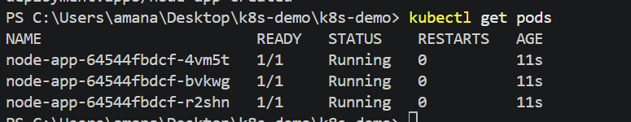
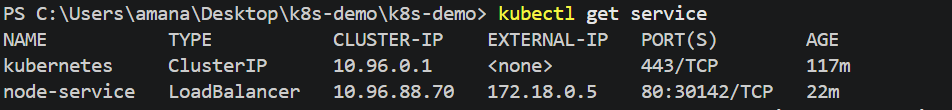

## Overview
Containerized Node.js application deployment workflow using Docker and Kubernetes for scalable and portable application orchestration. Docker handles application containerization and image creation, while Kubernetes manages deployment, replication, networking, load balancing, and pod orchestration.

## Architecture
Windows Host    
↓
Docker Desktop    
↓
Kubernetes Cluster   
↓
Deployment    
↓
Pods    
↓
Containers

## Workflow
Application    
↓
Docker Image Build    
↓
Kubernetes Deployment    
↓
Pod Creation    
↓
Service Exposure    
↓
Load Balanced Access

## Deployment Flow

- Docker image containing application code, runtime, and dependencies
- Kubernetes Deployment managing multiple pod replicas
- Pods running isolated container instances
- Kubernetes Service exposing application and routing traffic across pods
- Automatic pod recreation and replica maintenance through Kubernetes orchestration

## Traffic Routing
Client   
↓
Kubernetes Service 
↓   ↓   ↓
Pod Pod Pod

## Features
* Containerized deployment
* Pod orchestration
* Replica scaling
* Service-based networking
* Load balancing
* Self-healing pod management

## Outcome
Portable and scalable container orchestration workflow with automated deployment, networking, scaling, and runtime management using Docker and Kubernetes.

## result
### running pods 

### running load balancing service
 
